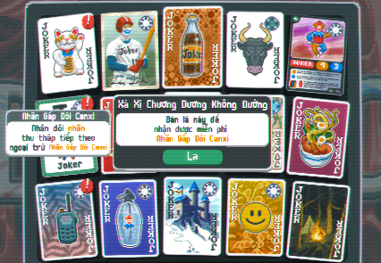

# Việt Hoá cho Balatro




Hướng dẫn này chỉ cách thêm ngôn ngữ Tiếng Việt vào trò chơi **[Balatro](https://www.playbalatro.com/)** *tự dịch :v*
(Quay lại bản tiếng anh ở [đây](readme.md))

## Yêu cầu
Đối với người dùng Windows, bạn cần có **7-Zip** (Mình đã thử với **WinRAR** và có bước không làm được)

## Tìm Mã Nguồn Balatro
Tìm mã nguồn cho game chạy trên **LÖVE** khá là đơn giản. **LÖVE** lưu game như 1 file nén.
- **Windows**: 
  - Tìm vị trí file `Balatro.exe` [^1]
  - Chuột phải vào `Balatro.exe`
  - (Nếu là Win 11) Chọn **Show more options**
  - Chọn **7-Zip>Open archive**
- **MacOS**: 
  - Tìm vị trí file `Balatro` [^1]
  - Chuột phải vào `Balatro`
  - Chọn **Show Package Contents**
  - Vào thư mục `Contents/Resources/`
  - Chuột phải vào `Balatro.love`
  - Chọn **Open With>Archive Utility** để giải nén nó (hoặc chỉ cần nhấn đúp vào)
  - Mở thư mục **Balatro**
- **Linux**: \*Sẽ cập nhật sau\*

## Thêm Tiếng Việt

### Thêm Phông Chữ
Phông chữ mặc định của game khá là hợp nên mình không muốn thay thế nó. Mình vẽ thêm mấy ký tự tiếng việt và lưu lại ở [đây](./fonts/m6x11plus_vi.ttf). Tải file đó và để nó vào **/resources/fonts/**.

### Thêm Bản Dịch

Bản dịch việt hoá mình dịch lại ở [đây](./current/vi.lua). Tải file đó và để nó vào **/localization/**.

Để bản dịch được hiển thị trong game, bạn hãy chỉnh sử file `game.lua` như sau:
- Tìm khai báo biến `self.LANGUAGES` (đâu đó dòng 942).
- Chèn thêm đoạn mã sau vào cuối khai báo biến đó (đâu đó dòng 959):
    ```lua
    ['vi'] = {font = 10, label = "Tiếng Việt", key = 'vi', beta = true, button = "Phản hồi ngôn ngữ", warning = {'This language is still in Beta. To help us','improve it, please click on the feedback button.', 'Click again to confirm'}},
    ```
    Sau khi chèn xong thì nó nhìn giống giống vầy
    ```lua
        ['all2'] = {font = 9, label = "English", key = 'all', omit = true},
        ['vi'] = {font = 10, label = "Tiếng Việt", key = 'vi', beta = true, button = "Phản hồi ngôn ngữ", warning = {'This language is still in Beta. To help us','improve it, please click on the feedback button.', 'Click again to confirm'}},
    }
    ```
- Tìm tiếp khai báo biến `self.FONTS` (đâu đó dòng 969).
- Chèn thêm đoạn mã sau vào cuối khai báo biến đó (đâu đó dòng 978):
    ```lua
    {file = "resources/fonts/m6x11plus_vi.ttf", render_scale = self.TILESIZE*10, TEXT_HEIGHT_SCALE = 0.9, TEXT_OFFSET = {x=10,y=-20}, FONTSCALE = 0.1, squish = 1, DESCSCALE = 1},
    ```
    Sau khi chèn xong thì nó nhìn giống giống vầy
    ```lua
        {file = "resources/fonts/GoNotoCJKCore.ttf", render_scale = self.TILESIZE*10, TEXT_HEIGHT_SCALE = 0.8, TEXT_OFFSET = {x=10,y=-20}, FONTSCALE = 0.1, squish = 1, DESCSCALE = 1},
        {file = "resources/fonts/m6x11plus_vi.ttf", render_scale = self.TILESIZE*10, TEXT_HEIGHT_SCALE = 0.9, TEXT_OFFSET = {x=10,y=-20}, FONTSCALE = 0.1, squish = 1, DESCSCALE = 1},
    }
    ```
- Lưu lại
- (Windows) 7-Zip sẽ hỏi có muốn update lại file nén này không thì bạn bấm Yes
- (MacOS) Bạn cần phải cập nhật `Balatro.love` thay chỉ vì `Balatro`, cập nhật như sau
  - Quay lại thư mục `Resource` (Thư mục chứa `Balatro`)
  - Chuột phải vào `Balatro`
  - Chọn `New Terminal at Folder`
  - Thực thi lệnh sau: 
      ```bash
      zip -r9 ../Balatro.love .
      ```

## That's all

[^1]: Người dùng Steam có thể vào Library, tìm Balatro, chuột phải và chọn `Manage>Browse Local Files`