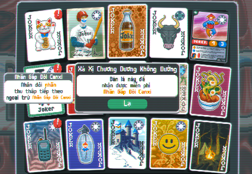

# Việt hoá Balatro




Đây là bản Việt hoá không chính thức cho [Balatro](https://www.playbalatro.com/), gồm:
1. Font tiếng Việt cho game.
2. File dịch tiếng Việt.
3. Script tự động chép file, vá `game.lua`, và build lại `Balatro.love`.
4. Công cụ web để chỉnh bản dịch JSON/Lua.

Bản tiếng Anh: xem tại [readme.md](readme.md).

## Cấu trúc thư mục
1. `current/vi.lua`: bản dịch đang dùng để deploy.
2. `fonts/m6x11plus_vi.ttf`: font đã thêm glyph tiếng Việt.
3. `commands/`: script tự động extract, copy, patch, rebuild.
4. `tools/`: công cụ chuyển đổi Lua/JSON và trình sửa trên web.

## Yêu cầu
1. Đã cài Balatro trên máy.
2. Có `zip` và `unzip` trong terminal.
3. Windows: khuyến nghị dùng 7-Zip để mở file game.

## Tìm thư mục Resources của Balatro
1. macOS:
   - Mở package của app Balatro.
   - Vào `Contents/Resources/`.
   - Trong đó có `Balatro.love`.
2. Windows:
   - Tìm `Balatro.exe`.
   - Mở bằng 7-Zip.
3. Linux:
   - Tìm thư mục cài game và file `Balatro.love` tương tự.

## Cách nhanh nhất (khuyên dùng)
Từ thư mục gốc repo:

```bash
cd commands
./shortcut.sh -z -f -l -b
```

Lệnh trên sẽ tự làm toàn bộ:
1. Giải nén `Balatro.love` vào `Resources/Balatro`.
2. Chép font tiếng Việt vào `resources/fonts/`.
3. Chép bản dịch vào `localization/vi.lua`.
4. Vá `game.lua` (thêm mục `vi` trong `self.LANGUAGES` và font trong `self.FONTS` nếu chưa có).
5. Build lại `Balatro.love`.

### Tuỳ chọn script

```bash
./shortcut.sh [-z] [-f] [-l] [-b] [-p <đường_dẫn_resources>]
```

1. `-z`: giải nén lại từ `Balatro.love`.
2. `-f`: chép font tiếng Việt.
3. `-l`: chép file dịch.
4. `-b`: vá `game.lua` và build lại `Balatro.love`.
5. `-p`: chỉ định thủ công đường dẫn thư mục `Resources`.

Ví dụ dùng đường dẫn custom:

```bash
./shortcut.sh -p "/path/to/Balatro.app/Contents/Resources" -z -f -l -b
```

## Cách thủ công
Nếu không dùng script:
1. Chép `fonts/m6x11plus_vi.ttf` vào `resources/fonts/`.
2. Chép `current/vi.lua` thành `localization/vi.lua`.
3. Sửa `game.lua`:
   - Thêm mục `vi` trong `self.LANGUAGES`.
   - Thêm font `m6x11plus_vi.ttf` trong `self.FONTS`.
4. Nén lại thành `Balatro.love`.

## Công cụ web chỉnh bản dịch
File `tools/index.html` là trình chỉnh JSON trực quan.

### Cách dùng
1. Mở `tools/index.html` bằng trình duyệt.
2. Tải file JSON bản dịch lên.
3. Chỉnh sửa, tìm/thay thế, rồi xuất JSON hoặc Lua.

## Chuyển Lua sang JSON
Chạy trong thư mục `tools/`:

```bash
lua lua_to_json.lua ../lang.lua output.json
```

Nếu không truyền tham số:
1. Input mặc định: `../lang.lua`
2. Output mặc định: `output.json`

## Lưu ý
1. Đây là dự án cộng đồng, không phải bản chính thức.
2. Nên backup file gốc trước khi patch.
